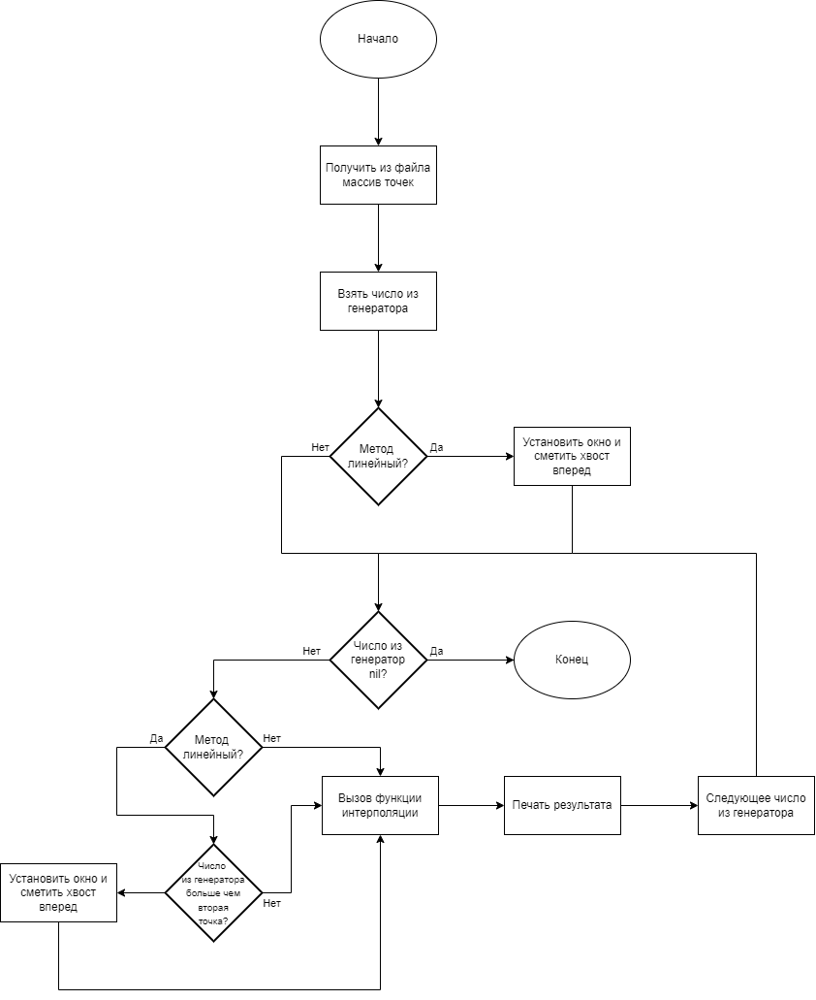

# Functional Programming 3
## Цель

Получить навыки работы с вводом/выводом, потоковой обработкой данных, командной строкой.

## Задание
В рамках лабораторной работы вам предлагается повторно реализовать лабораторную работу по предмету "Вычислительная математика" посвящённую аппроксимации (в разные годы это лабораторная работа 3 или 4) со следующими дополнениями:

- обязательно должна быть реализована линейная интерполяция (отрезками, [link](https://en.wikipedia.org/wiki/Linear_interpolation));
- настройки алгоритма аппроксимирования и выводимых данных должны задаваться через аргументы командной строки:
    - какие алгоритмы использовать (в том числе два сразу);
    - частота дискретизации результирующих данных;
    - и т.п.;
- входные данные должны задаваться в текстовом формате на подобии ".csv" (к примеру `x;y\n` или `x\ty\n`) и подаваться на стандартный ввод, входные данные должны быть отсортированы по возрастанию x;
- выходные данные должны подаваться на стандартный вывод;
- программа должна работать в потоковом режиме (пример -- `cat | grep 11`), это значит, что при запуске программы она должна ожидать получения данных на стандартный ввод, и, по мере получения достаточного количества данных, должна выводить рассчитанные точки в стандартный вывод;

Приложение должно быть организовано следующим образом:

```text
    +---------------------------+
    | обработка входного потока |
    +---------------------------+
            |
            | поток / список / последовательность точек
            v
    +------------------------+      +------------------------------+
    | алгоритм аппроксимации |<-----| генератор точек, для которых |
    +------------------------+      | необходимо вычислить         |
            |                       | аппроксимированное значение   |
            |                       +------------------------------+
            |
            | поток / список / последовательность рассчитанных точек
            v
    +------------------------+
    | печать выходных данных |
    +------------------------+
```

Потоковый режим для алгоритмов, работающих с группой точек должен работать следующим образом:

```text
o o o o o o . . x x x
  x x x . . o . . x x x
    x x x . . o . . x x x
      x x x . . o . . x x x
        x x x . . o . . x x x
          x x x . . o . . x x x
            x x x . . o o o o o o EOF
```

где:

- каждая строка -- окно данных, на основании которых производится расчёт алгоритма;
- строки сменяются по мере поступления в систему новых данных (старые данные удаляются из окна, новые -- добавляются);
- `o` -- рассчитанные данные, можно видеть:
    - большинство окон используется для расчёта всего одной точки, так как именно в "центре аппроксимации" результат наиболее точен;
    - первое и последнее окно используются для расчёта большого количества точек, так лучших данных для расчёта у нас не будет.
- `x` -- точки, расчёт которых для "окон" не требуется.

### Общие требования
* программа должна быть реализована в функциональном стиле;
* ввод/вывод должен быть отделён от алгоритмов аппроксимации;
* требуется использовать идиоматичный для технологии стиль программирования.

## Релизация

### Структура

Программа состоит из следующих модулей:
* generator - модуль с объявлением функций для создания генератора значений.
* inputs - модуль с функциями для ввода-вывода из консоли или файла.
* main - модлуль с функцией управления вычисленями.
* methods - модуль с функциями интерполяции.
* run -  модуль являющийся точкой входа для запуска из консоли.
* utils - модуль для вспомогательных функций, в том числе решения уравнений методом Гаусса-Зейделя

### Алгоритм

Организация приложения:



### Пример

Получение точек из консоли, линейный метод:

```text
Input from files? (y/n)
n
Enter number of points:
3
1 1
2 2
3 3
Line method? (y/n)
y

0  0
1  1
2  2
3  3
4  4
5  5
6  6
7  7
```

Получение точек из файла, линейный метод:

```text
Input from files? (y/n)
y
Enter filename:
test.txt
Line method? (y/n)
y

0  1
1  1
2  1
3  3
4  5
5  7
6  9
7  11
```

Файл test.txt

```text
1 1
2 1
3 3
```

Получение точек из консоли, степенной метод:

```text
Input from files? (y/n)
n
Enter number of points:
3
1 1
2 1
3 2
Line method? (y/n)
n

0  0.0
1  0.90015256
2  1.3298088
3  1.6708006
4  1.9645466
5  2.2275143
6  2.4682987
7  2.6920755
```

## Вывод

При выполнении лабораторной работы я лучше познакомилась с обработкой массивов в Lisp. В работе с файлами или коммандной строкой.


